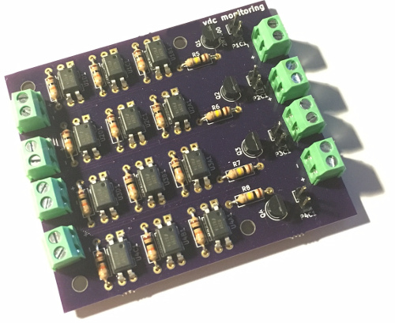

# vdcmon

KiCad files for 4-channel voltage monitoring switchboard.

Channels are fully isolated from each other and a common ground is not
required. Channel isolation is achieved using FT817 opto-isolators.

Voltage on any set of channels can be used to enable all outputs.
Whether or not a channel enables all outputs can be selected using a
jumper. With a jumper in place, a voltage on the channel switches on
all opto-isolators for that channel, which in turn turn on the output
MOSFETs.

The outputs can then be hooked up to self-powered voltage monitors,
such as [this one on eBay][hs12v].

[hs12v]: http://www.ebay.com/itm/HS-12V-Waterproof-Red-LED-DC-Digital-Display-Voltmeter-Meter-for-Car-Motor-/152054985723

I'm using this board for voltage monitoring of a battery pack with
integrated charger, low voltage disconnect, and voltage booster. The
voltage monitors should only be turned on if either the charger is
connected or the output is switched on. If the output is switched off
and the charger is not connected, the voltage monitors must be turned
off, or they would drain the battery.

## Assembled board

Fabricated by [OSH Park](https://oshpark.com/).

